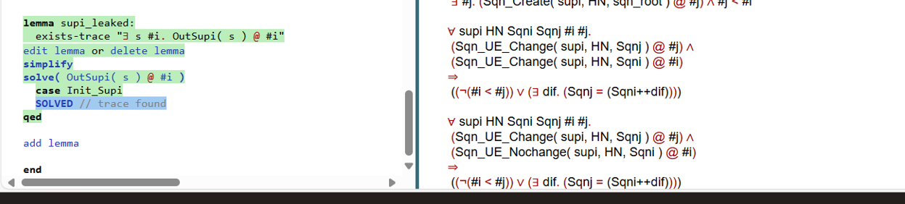
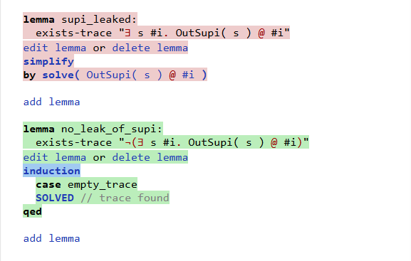
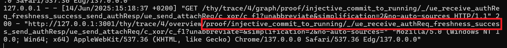

# 5G-AKA Formal Verification — Cyber Security Lab Project

This project presents a formal verification of the **5G Authentication and Key Agreement (5G-AKA)** protocol using the **Tamarin Prover**, as part of a master's-level Cyber Security lab. It includes both the original model and an extended version simulating privacy attacks on the SUPI.

---

##  Lab Context

- **Goal**: Analyze the correctness and security of 5G-AKA using formal methods.
- **Tool**: [Tamarin Prover v1.11.0](https://tamarin-prover.github.io/)
- **Environment**: WSL2 (Ubuntu 24.04) on Windows 11
- **Model**: Based on the official CCS'18 `5G_AKA_fix.spthy` from Tamarin examples.

---

##  Prerequisites & Dependencies

To run the formal verification models in this repository, the following tools and libraries must be installed on your system:

### Core Dependencies

- **Tamarin Prover** (version ≥ 1.11.0)  
  [Install guide](https://tamarin-prover.github.io/)  
  You can install it on Ubuntu WSL with:
  ```bash
  sudo apt update
  sudo apt install tamarin-prover
  ```

- **GHC (Glasgow Haskell Compiler):**  
  ```bash
  sudo apt install ghc
  ```

- **Z3 SMT Solver (used by Tamarin for proving complex lemmas):**  
  ```bash
  sudo apt install z3
  ```

---

##  Features & Contributions

- **Original model** (`5G_AKA_fix.spthy`): Clean 5G-AKA model from CCS’18.
- **Extended model** (`5G_AKA_fix_nour_attack.spthy`) includes:
  - `init_supi` and `leak_supi` attacker rules to simulate identity leakage.
  - Lemmas:
    - `supi_leaked`: proves SUPI can be leaked.
    - `no_leak_of_supi`: checks SUPI secrecy under ideal settings.
    - `injective_commit_to_running`: ensures injective agreement between UE and SN.
  - Visual proofs & rules in the `/images/` directory.

---

##  Repository Structure

```
5G-Formal-Verification-Nour-Hmeedan/
├── 5G_AKA_fix.spthy                     # Original model
├── 5G_AKA_fix_nour_attack.spthy        # my modified version
├── images/                             # Screenshots of lemmas and rules
│   ├── added_rules.png
│   ├── injective_commit_to_running_lemma.png
│   └── supi_leaked_And_no_leak_of_supi_lemmas.png
```

---

---

## Lemma Verification Results

This section presents the visual results of verifying key security properties using Tamarin Prover.

### SUPI Leakage Attack (`supi_leaked`)
This lemma demonstrates that SUPI is leaked under certain attack conditions.



---

### No Leakage Under Ideal Conditions (`no_leak_of_supi`)
This lemma proves that, under ideal conditions, SUPI is **not leaked**, confirming secrecy.



---

### Injective Agreement Verification (`injective_commit_to_running`)
This lemma proves that a `Commit` from the UE corresponds uniquely to a `Running` session at the SEAF.



